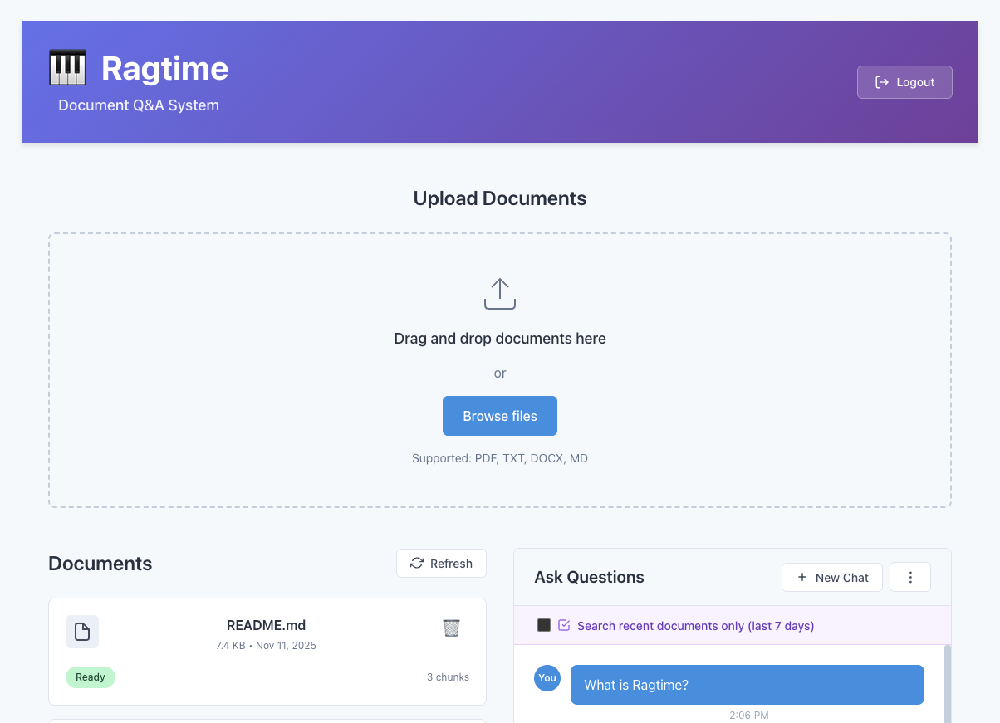
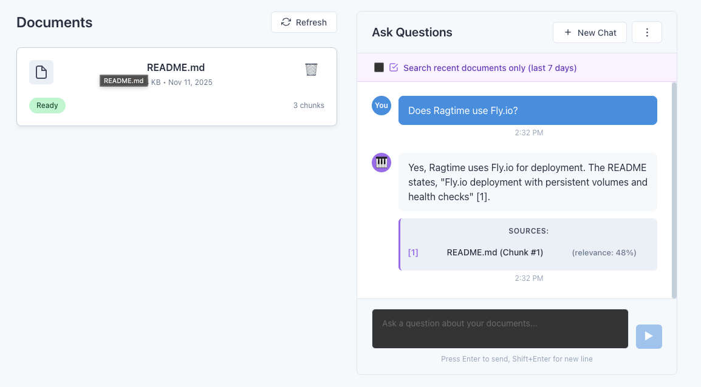
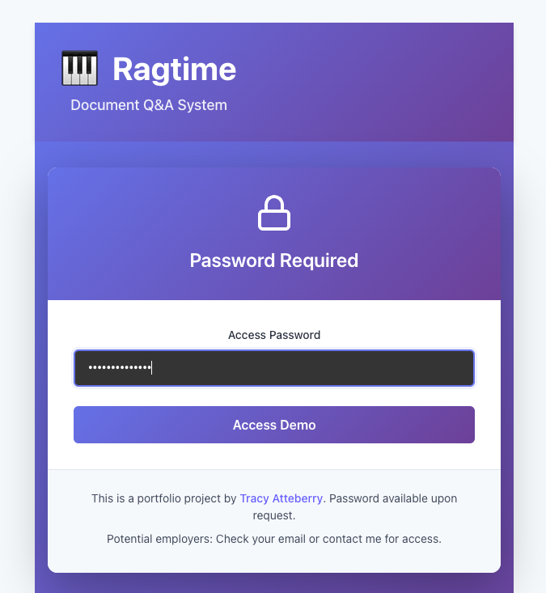

# 🎹 Ragtime: Document Q&A System

   

A document Q&A system that demonstrates modern full-stack development skills with Rails 8, Vue.js, and AI-powered search.

## ✨ Features

- **📄 Document Upload**: Drag-and-drop PDF, TXT, DOCX, and MD files
- **🤖 AI-Powered Q&A**: Ask questions and get cited answers from your documents
- **🔗 Interactive Citations**: Click citations to view source passages in context
- **📊 Document Management**: Organize and search uploaded documents
- **🔒 Session Authentication**: Professional login flow for access control
- **📱 Responsive Design**: Works seamlessly on desktop and mobile devices

## 🚀 Live demo

**[Request access to live demo](https://ragtime-demo.fly.dev)** - Production-deployed and ready for review

> **Note**: The demo is hosted by fly.io and requires password authentication
> for security. If you would like access, please contact me or my referring recruiter.

## 🛠 Tech stack

### Backend
- **Rails 8** API with modern Ruby features
- **SQLite + sqlite-vec** for vector similarity search
- **Solid Queue** for background job processing (in-process via Puma)
- **OpenAI** integration for embeddings (text-embedding-3-small) and chat (gpt-4o-mini)

### Frontend
- **Vue.js 3** with Composition API
- **Vite** for fast development and building
- **Vue Router 4** for client-side navigation

### DevOps & Deployment
- **Docker** multi-stage containerization
- **Nginx** reverse proxy in production
- **Fly.io** deployment with persistent volumes
- **Over 220 passing tests** with comprehensive coverage

## 📸 Screenshots

### Main Interface
<br>
*Ragtime's main interface - upload documents, ask questions, get cited answers*

<br>
*Ragtime's document chat interface - ask questions, get cited answers*

### Interactive Citations
<br>
*Click citations to view source passages in document context*

### Password Authentication
<br>
*Password authentication for secure access to the demo*

## ⚡ Quick Start

### Run with Docker

The Docker setup was tested on both Apple M3 (local) and Linux x64 (Fly.io).

**Prerequisites**
- Docker installed locally
- Production credentials configured (see below)

**Setup credentials**
The application requires Rails credentials to be configured before running:

```bash
# Clone the repository
git clone https://github.com/grymoire7/ragtime.git
cd ragtime

# Edit production credentials (required)
bin/rails credentials:edit --environment production
```

Add the following required credentials to `config/credentials/production.yml.enc`:

```yaml
# Required for application authentication
site_password: your-secure-password-here

# Required for AI functionality (production)
openai_api_key: sk-proj-your-openai-api-key-here
```

**Run the container**
```bash
./script/rebuild-and-run
```

Visit http://localhost:8080 to access the application. The password will be the `site_password` you configured above.

### Manual development setup

**Prerequisites**
- Ruby 3.3+
- Node.js 18+
- Docker (for container development)

**Setup instructions**
```bash
# Clone and setup
git clone https://github.com/grymoire7/ragtime.git
cd ragtime

# Backend setup
bundle install
bin/rails db:migrate
bundle exec rake vec_chunks:init

# Frontend setup
cd frontend
npm install
npm run build

# Start servers
cd ..
bin/rails server            # Backend (http://localhost:3000)
cd frontend && npm run dev  # Frontend (http://localhost:5173)
```

**Running tests**
```bash
# Backend tests
bundle exec rspec

# Frontend tests
cd frontend && npm run test
```

## 🏗 Architecture

### System overview

```mermaid
flowchart TD
    A[Vue.js Frontend] <--> B[Rails 8 API]
    B <--> C[SQLite + sqlite-vec]
    B --> D[Solid Queue Jobs]
    D --> E[OpenAI APIs]

    style A fill:#41B883,stroke:#333,stroke-width:2px
    style B fill:#CC0000,stroke:#333,stroke-width:2px
    style C fill:#003B57,stroke:#333,stroke-width:2px
    style D fill:#6F42C1,stroke:#333,stroke-width:2px
    style E fill:#412991,stroke:#333,stroke-width:2px
```



### Key components

**Backend services**
- `ChunkRetriever`: Vector similarity search with L2 distance
- `PromptBuilder`: RAG prompt construction with document context
- `AnswerGenerator`: LLM integration with structured citation extraction
- `TextChunker`: Intelligent document chunking (800 tokens, 200 overlap)
- `EmbeddingGenerator`: Batch processing for vector embeddings

**Document processing pipeline**
1. **Upload**: Documents stored via Active Storage
2. **Extract**: Text extraction from PDF, TXT, DOCX, MD formats
3. **Chunk**: Intelligent segmentation with overlap for context
4. **Embed**: Vector generation using OpenAI text-embedding-3-small
5. **Store**: Chunks and embeddings in SQLite with vector search

### Technical decisions

| Decision | Rationale |
|----------|-----------|
| SQLite + sqlite-vec **vs** PostgreSQL + pgvector | Simplified deployment, single file, appropriate for demo scale |
| Rails 8 API **vs** monolith | Clean separation, modern frontend stack, API-first design |
| Vue.js SPA **vs** Hotwire | Better UX for chat interface, modern JavaScript skills |
| Solid Queue in-process **vs** Sidekiq | Deployment simplicity, Rails 8 integration |
| Single container **vs** microservices | Faster deployment, appropriate for project scope |

## 🧪 Testing

- **Over 220 passing specs** with comprehensive test coverage
- **Unit tests** for all models and services
- **Integration tests** for complete RAG pipeline
- **API endpoint testing** for all controller actions
- **Frontend component tests** for Vue.js components

## 📚 Portfolio highlights

- **🐳 Production container**: Multi-stage Dockerfile with cross-platform builds (ARM64 → AMD64)
- **🚀 Real deployment**: Fly.io deployment with persistent volumes and health checks
- **📈 Error handling**: Comprehensive error handling, input validation, and graceful degradation
- **🔐 Security**: Session-based authentication, API key management, input sanitization
- **📝 Documentation**: Complete API docs, architecture docs, and development guides
- **🔧 Developer tools**: Convenient scripts for local development, debugging, and deployment

## 🔧 Development tools

**Convenient scripts**
```bash
./script/build-local      # Build cross-platform Docker container
./script/run-local        # Run container with proper Rails credentials
./script/rebuild-and-run  # Build and run in one command
./script/logs             # View container logs
./script/db-status        # Check database and vector table status
```

**Container access**
- Rails API: http://localhost:8080
- Vue.js Frontend: http://localhost:8080/frontend/
- Database: SQLite with persistent volume storage

## 📖 Documentation

- **[Blog post](https://tracyatteberry.com/posts/ragtime)** - Deep dive into architecture and technical decisions
- **[Portfolio](https://tracyatteberry.com/portfolio)** - Other projects and experience
- **[About](https://tracyatteberry.com/about)** - Background and contact information

## 🤝 Contributing

This is a portfolio project demonstrating professional development practices. While contributions aren't being accepted, the codebase serves as an example of:

- Clean, maintainable Rails 8 code
- Modern Vue.js frontend architecture
- Comprehensive testing strategies
- Production deployment practices
- Professional documentation standards

## 🤖 AI acknowledgment

Some portions of this project were assisted by AI tools for code generation and
documentation. All code and content have been reviewed and refined to ensure
quality and accuracy. This project was not "vibe coded" by AI; it reflects
professional development skills and practices. Claude Code was used with both
Sonnet and GLM models. See [blog post](https://tracyatteberry.com/blog/ragtime)
for more details about my challenges and learnings while using AI with this
project.

## 📄 License

MIT License - see [LICENSE](LICENSE) file for details.

---

**Built with ❤️ using Rails 8, Vue.js, and modern development practices**
