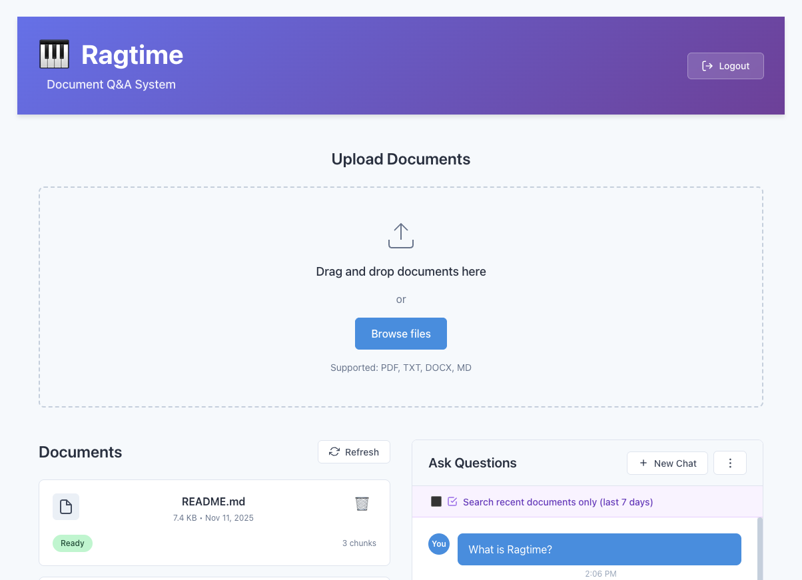
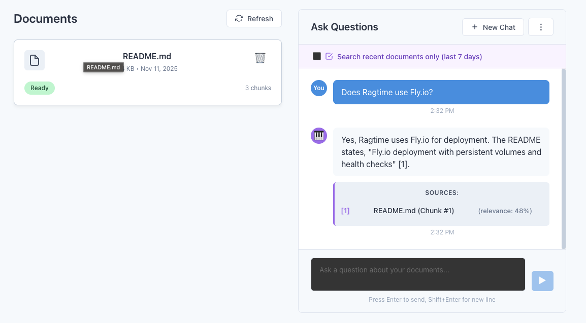
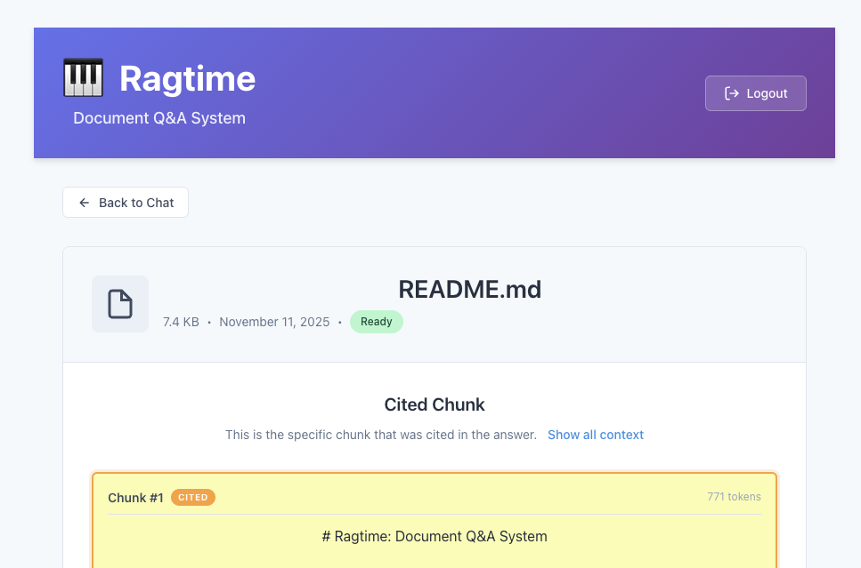
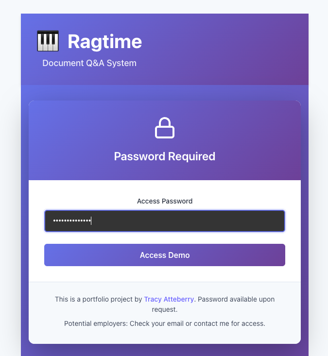

# 🎹 Ragtime: Document Q&A System

*A full-stack RAG demo that answers questions from your own documents.*

   

## Overview

Ragtime is a document Q&A system built to show off modern full-stack development with Rails 8, Vue.js, and AI-powered search. Upload a document, ask a question about it, and get an answer with citations back to the exact passage it came from.

Core features:

- **Document upload**: drag-and-drop PDF, TXT, DOCX, and MD files
- **AI-powered Q&A**: ask questions and get cited answers pulled straight from your documents
- **Interactive citations**: click a citation to see the source passage in context
- **Document management**: organize and search your uploaded documents
- **Session authentication**: a simple login flow gates access
- **Responsive design**: works on both desktop and mobile

### Screenshots

<br>
*Ragtime's main interface: upload documents, ask questions, get cited answers*

<br>
*Ragtime's document chat interface*

<br>
*Click citations to view source passages in document context*

<br>
*Password authentication for secure access to the demo*

Under the hood, uploaded documents get extracted, split into overlapping chunks (800 tokens, 200 token overlap), embedded with OpenAI's text-embedding-3-small, and stored in SQLite via the sqlite-vec extension. When you ask a question, Ragtime retrieves the closest chunks by cosine distance, builds a grounded prompt, and asks gpt-4o-mini to answer with citations back to the source.

A few deliberate trade-offs shaped the stack: SQLite with sqlite-vec instead of Postgres with pgvector keeps deployment to a single file and is plenty for demo scale; a Vue single-page app instead of Hotwire makes for a better chat interface; and Solid Queue runs in-process via the Puma plugin instead of a separate Sidekiq worker, which keeps deployment simple. See the design doc linked below for the full rundown.

The backend and frontend are covered by more than 220 RSpec and Vitest specs, including integration tests for the full retrieval-to-answer pipeline.

This is a solo portfolio project, so it isn't open to outside contributions, but feel free to browse the code. Some of it, including parts of this documentation, was written with AI assistance (Claude Code, using both Sonnet and GLM models) and then reviewed and refined by hand. It wasn't vibe coded: the goal is to demonstrate real engineering judgment, and the blog post below covers the challenges and lessons from that process.

## Stack

**Backend**
- Rails 8 API with modern Ruby features
- SQLite + sqlite-vec for vector similarity search
- Solid Queue for background job processing (in-process via Puma)
- OpenAI for embeddings (text-embedding-3-small) and chat (gpt-4o-mini)

**Frontend**
- Vue.js 3 with the Composition API
- Vite for development and builds
- Vue Router 4 for client-side navigation

**Deployment**
- Docker multi-stage containerization
- Nginx reverse proxy in production
- Docker Compose with persistent volumes

## Setup

### Run with Docker

The Docker setup has been tested on both Apple M3 (ARM64) and Linux x64.

**Prerequisites**
- Docker installed locally
- Production credentials configured (see below)

**Setup credentials**

The application requires Rails credentials to be configured before running:

```bash
# Clone the repository
git clone https://github.com/grymoire7/ragtime.git
cd ragtime

# Edit production credentials (required)
bin/rails credentials:edit --environment production
```

Add the following required credentials to `config/credentials/production.yml.enc`:

```yaml
# Required for application authentication
site_password: your-secure-password-here

# Required for AI functionality (production)
openai_api_key: sk-proj-your-openai-api-key-here
```

**Run the container**

```bash
./script/rebuild-and-run
```

Visit http://localhost:8080 to access the application. The password is the `site_password` you configured above.

**Convenience scripts**

```bash
./script/build-local      # Build cross-platform Docker container
./script/run-local        # Run container with proper Rails credentials
./script/rebuild-and-run  # Build and run in one command
./script/logs             # View container logs
./script/db-status        # Check database and vector table status
```

**Container access**
- Rails API: http://localhost:8080
- Vue.js frontend: http://localhost:8080/frontend/
- Database: SQLite with persistent volume storage

### Manual setup

**Prerequisites**
- Ruby 3.4.5 (managed via mise, see `mise.toml`)
- Node.js 18+
- Docker (only needed for container development)

```bash
# Clone and setup
git clone https://github.com/grymoire7/ragtime.git
cd ragtime

# Backend setup
bundle install
bin/rails db:migrate
bundle exec rake vec_chunks:init

# Frontend setup
cd frontend
npm install
```

Once dependencies are installed, use `pitchfork start` to run the API and frontend dev servers together. See Tasks below.

## Tasks

`pitchfork.toml` defines two daemons: `api` runs the Rails server on port 3000, and `web` runs the Vue dev server (in `frontend/`) on port 5173. Running `pitchfork start` boots both at once.

Day-to-day commands come from `mise.toml`:

```bash
mise run test             # Run the backend RSpec suite
mise run lint             # Rubocop (rubocop-rails-omakase)
mise run frontend:build   # Production build of the Vue frontend
mise run frontend:test    # Run the frontend Vitest suite once (not watch mode)
```

Tasks that operate inside `frontend/` are prefixed with `frontend:` so it's clear at a glance which app they touch. The backend tasks stay bare since this is primarily a Rails project.

## Documentation

- **[Design doc](docs/initial-design.md)**: the original project plan and architecture rationale
- **[Blog post](https://tracyatteberry.com/posts/ragtime)**: a deep dive into architecture and technical decisions
- **[Portfolio](https://tracyatteberry.com/portfolio)**: other projects and experience
- **[About](https://tracyatteberry.com/about)**: background and contact information

## License

MIT License, see [LICENSE](LICENSE) file for details.
