```mermaid
flowchart TD
    A[Vue.js Frontend] <--> B[Rails 8 API]
    B <--> C[SQLite + sqlite-vec]
    B --> D[Solid Queue Jobs]
    D --> E[OpenAI APIs]

    style A fill:#41B883,stroke:#333,stroke-width:2px
    style B fill:#CC0000,stroke:#333,stroke-width:2px
    style C fill:#003B57,stroke:#333,stroke-width:2px
    style D fill:#6F42C1,stroke:#333,stroke-width:2px
    style E fill:#412991,stroke:#333,stroke-width:2px
```

# Building a document Q&A system with Rails 8, SQLite-vec, and OpenAI

Every company wants to plug AI into their proprietary data. But here's the
thing—it's not just about calling an API. The real challenge is building
systems that actually work reliably and are maintainable in the real world.

So I built Ragtime. Think of it as my playground for figuring out how to build
modern AI applications the right way. It's a document Q&A system where you can
upload PDFs, Word docs, text files, and Markdown, then ask questions and get
answers with actual source citations.

What I really wanted to show wasn't just that I can build an AI app—anyone can
do that these days. I wanted to demonstrate how a senior engineer thinks about
building these systems from the ground up, making smart trade-offs and avoiding
common pitfalls.

## Architecture overview

So what does Ragtime actually look like under the hood? At its core, it's a RAG
(Retrieval-Augmented Generation) system—fancy talk for "find relevant material,
then use it to answer questions."



Here's how it works: you upload a document, the system pulls out the text,
chops it into smart chunks, turns those chunks into mathematical vectors (more
on that in a bit), and then when you ask a question, it finds the most relevant
chunks and uses them to generate an answer with citations. Simple, right? Well,
there are some fun challenges along the way.

### Why this architecture?

Let me tell you why I picked this stack. Rails 8 just clicked for the backend
because it's got some really nice improvements for modern apps—better API
support out of the box, Solid Queue built right in (no more juggling separate
worker processes), and some solid performance tweaks--especially for SQLite.
Going API-only gave me this clean separation between frontend and backend,
which makes everything easier to maintain and reason about.

For the frontend, Vue.js 3 with the Composition API just feels right for chat
interfaces. You get way better state management than server-rendered options,
and the component-based architecture makes complex UI stuff like real-time chat
and interactive citations so much easier to build.

## The vector storage decision: SQLite + sqlite-vec

This was probably the biggest technical decision I had to make—how to store all
those vector embeddings. I looked at three options:

1. **PostgreSQL + pgvector**: This is what everybody uses in production
2. **Dedicated vector databases** (like Pinecone or Weaviate): The fancy specialized solutions
3. **SQLite + sqlite-vec**: The simple, "just make it work" approach

I went with SQLite + sqlite-vec, and I have to be honest—it was way more
complicated than I expected. Here's my thinking: when you're trying to show
engineering competence, deployment simplicity matters more than theoretical
scalability. But sqlite-vec turned out to be a significant engineering challenge
in its own right.

The extension doesn't just work out of the box. I had to:
- Bootstrap it manually in the docker-entrypoint for production
- Load it programmatically in code rather than declaring it in database.yml
- Add special verification in health check endpoints because if it fails to load,
  the entire RAG functionality breaks
- Turn off transactional fixtures in tests and create custom test support code

While SQLite gives you that single-file, zero-dependency promise, getting
sqlite-vec to work reliably required significant effort. This really highlights a
key engineering principle: sometimes the "simple" choice brings its own complex
challenges that you need to account for.

## Document processing pipeline

Building a document processing pipeline that actually works reliably meant
solving some pretty fun challenges:

### Challenge 1: Getting text out of different file types

First problem: documents come in all shapes and sizes. PDFs, Word docs, plain
text, Markdown—each one needs its own special handling trick. I ended up
building a `TextExtractor` service that's basically a Swiss Army knife for file
formats. It knows how to handle each type, and when things go wrong (which they
always do), it fails gracefully and tells you what happened.

```ruby
# app/services/document_processing/text_extractor.rb
class DocumentProcessing::TextExtractor
  def self.extract(file)
    case file.content_type
    when 'application/pdf'
      PdfReader.new(file).extract_text
    when 'application/vnd.openxmlformats-officedocument.wordprocessingml.document'
      DocxReader.new(file).extract_text
    when 'text/plain', 'text/markdown'
      file.download
    else
      raise "Unsupported file type: #{file.content_type}"
    end
  rescue => error
    Rails.logger.error "Text extraction failed: #{error.message}"
    raise DocumentProcessing::ExtractionError, "Failed to extract text from document"
  end
end
```

### Challenge 2: Splitting text intelligently

Getting the chunking right is crucial for RAG systems. The key challenge is
maintaining context—chunks need to be small enough to be relevant but large
enough to retain meaning.

I implemented a `TextChunker` that creates 800-token chunks with 200 tokens of
overlap, which is a well-established pattern in RAG systems. The overlap
ensures related context spans multiple chunks, and the system respects
paragraph boundaries to maintain semantic coherence.

The overlap is particularly important—it keeps related ideas connected across
chunk boundaries. I used tiktoken_ruby for accurate token counting because
different models count tokens differently, and that accuracy significantly
affects chunk quality.

### Challenge 3: Implementing vector similarity search

The `ChunkRetriever` handles the core vector search functionality. It generates
embeddings for queries and uses sqlite-vec's virtual tables to find the most
similar chunks. The challenge here was tuning the similarity threshold—too low
and you get irrelevant results, too high and you get no results at all.

```ruby
# app/services/rag/chunk_retriever.rb
class Rag::ChunkRetriever
  DEFAULT_THRESHOLD = 1.2 # L2 distance, tuned for quality results
  DEFAULT_LIMIT = 5

  def initialize(query:, threshold: DEFAULT_THRESHOLD, limit: DEFAULT_LIMIT)
    @query = query
    @threshold = threshold
    @limit = limit
  end

  def call
    # Generate embedding for query
    query_embedding = EmbeddingGenerator.generate(@query)

    # Vector similarity search using sqlite-vec
    chunks = execute_vector_search(query_embedding)

    # Convert to domain objects with metadata
    chunks.map { |chunk| ChunkResult.new(chunk) }
  end

  private

  def execute_vector_search(embedding)
    sql = <<-SQL
      SELECT chunks.*, vec_distance_cosine(chunks.embedding, ?) as distance
      FROM vec_chunks
      JOIN chunks ON vec_chunks.rowid = chunks.id
      WHERE vec_distance_cosine(chunks.embedding, ?) < ?
      ORDER BY distance
      LIMIT ?
    SQL

    sanitized_sql = ActiveRecord::Base.sanitize_sql_array([
      sql, embedding, embedding, @threshold, @limit
    ])

    ActiveRecord::Base.connection.execute(sanitized_sql)
  end
end
```

### Challenge 4: Background job processing

Document processing is computationally expensive—text extraction, chunking, and
embedding generation can take significant time. This work needs to happen
asynchronously to avoid blocking user interactions.

Rails 8's Solid Queue with the Puma integration was an excellent choice for
this use case. No separate worker processes to manage—everything runs in the
background while keeping the app responsive. The in-process approach simplifies
deployment significantly.

```ruby
# app/jobs/process_document_job.rb
class ProcessDocumentJob < ApplicationJob
  retry_on StandardError, wait: :exponentially_longer, attempts: 3

  def perform(document)
    document.update!(status: :processing)

    # Extract text content
    text_content = DocumentProcessing::TextExtractor.extract(document.file)

    # Create chunks with overlap
    chunks = DocumentProcessing::TextChunker.chunk(text_content)

    # Generate embeddings in batches
    embeddings = EmbeddingGenerator.generate_batch(chunks.map(&:content))

    # Store chunks with embeddings
    chunks.each_with_index do |chunk, index|
      document.chunks.create!(
        content: chunk[:content],
        position: chunk[:position],
        token_count: chunk[:token_count],
        embedding: embeddings[index]
      )
    end

    document.update!(status: :completed)
  rescue => error
    document.update!(status: :failed, error_message: error.message)
    raise
  end
end
```

This in-process approach means way less deployment headache while still giving
you reliable background job processing. Sometimes simpler really is better.

## Frontend architecture: Vue.js 3 + Composition API

Building a chat interface that doesn't feel clunky is surprisingly hard. You
need to manage conversation state, message history, real-time updates... it
gets complicated fast.

Vue.js 3's Composition API turned out to be perfect for this. It gives you
these clean patterns for organizing complex component logic without everything
turning into spaghetti code. The chat interface keeps track of the
conversation, shows you messages as they come in, and makes citations
clickable—click one and it'll highlight the exact passage in the document.

I used Pinia for state management because it makes debugging so much easier,
and the whole component structure follows that separation of concerns principle
that keeps you sane when the app gets complex.

```javascript
// ChatInterface.vue (simplified)
import { ref, computed, onMounted } from 'vue'
import { useChatStore } from '@/stores/chat'

export default {
  setup() {
    const chatStore = useChatStore()
    const message = ref('')
    const loading = ref(false)

    const sendMessage = async () => {
      if (!message.value.trim()) return

      loading.value = true
      try {
        await chatStore.sendMessage(message.value)
        message.value = ''
      } finally {
        loading.value = false
      }
    }

    return {
      message,
      loading,
      currentChat: computed(() => chatStore.currentChat),
      sendMessage
    }
  }
}
```

## Citation extraction and storage

Here's something that drives me crazy about some AI apps: you get these
confident-sounding answers but have no idea where they came from. That's
terrible for user trust.

So I made sure every answer comes with citations. The `AnswerGenerator` service
basically tells the AI "hey, when you answer this, tell me exactly which chunks
you used" and stores all that in a nice structured format. This way users can
actually verify the answers, which is huge for building trust.

```ruby
# app/services/rag/answer_generator.rb
class Rag::AnswerGenerator
  def initialize(context:, question:)
    @context = context
    @question = question
  end

  def call
    response = ruby_llm.chat(
      messages: build_prompt,
      temperature: 0.3, # Lower temperature for more consistent responses
      response_format: { type: "json_object" }
    )

    parse_response(response)
  end

  private

  def build_prompt
    PromptBuilder.new(
      context: @context,
      question: @question,
      citation_format: "structured_json"
    ).build
  end

  def parse_response(response)
    data = JSON.parse(response.content)

    AnswerResult.new(
      content: data['answer'],
      citations: build_citations(data['citations'] || []),
      metadata: {
        model: response.model,
        usage: response.usage
      }
    )
  end

  def build_citations(citation_data)
    citation_data.map do |citation|
      {
        chunk_id: citation['chunk_id'],
        document_id: citation['document_id'],
        document_title: citation['document_title'],
        relevance: citation['relevance_score'],
        position: citation['position_in_document']
      }
    end
  end
end
```

All those citations get stored as JSON in the messages table, which means you
can replay conversations later and see exactly how the AI arrived at its
answers. Pretty handy for debugging and audit trails.

## Production deployment strategy

Getting an AI app to production is... an adventure. You've got infrastructure,
security, and a million operational concerns to think about. I went with Docker
containers and Fly.io because they strike a nice balance between power and
simplicity.

### Container architecture

The multi-stage Dockerfile was actually pretty fun to build. It optimizes for
both development and production, which means faster builds when you're
iterating and smaller images when you're deploying:

```dockerfile
# Multi-stage production Dockerfile
FROM ruby:3.3-slim AS base
WORKDIR /app
COPY Gemfile Gemfile.lock ./
RUN bundle install --deployment --without development test

# Build stage for frontend assets
FROM node:18-alpine AS frontend-build
WORKDIR /app/frontend
COPY frontend/package*.json ./
RUN npm ci
COPY frontend/ ./
RUN npm run build

# Production stage
FROM ruby:3.3-slim AS production
WORKDIR /app
COPY --from=base /usr/local/bundle/ /usr/local/bundle/
COPY . .
COPY --from=frontend-build /app/frontend/dist /app/public/frontend

# Production configuration and startup
RUN bin/rails assets:precompile
EXPOSE 8080
CMD ["./bin/docker-entrypoint"]
```

### Operational stuff that actually matters

Production isn't just about getting it running—it's about keeping it running.
Here's what I built in:

- **Health checks**: Custom endpoints so I can actually tell if the app and database are happy
- **Proper logging**: Structured logging with correlation IDs because debugging production without context is hell
- **Secrets management**: Rails credentials for API keys (never commit those to git!)
- **Persistent storage**: Fly.io persistent volumes for the SQLite database and uploaded files
- **Cross-platform builds**: Docker buildx so I can build on my ARM64 Mac but deploy to AMD64 servers

All this stuff matters way more than most people think when they're starting out.

## Code quality and testing approach

Look, here's the thing about AI systems: they're nondeterministic. The same
input can give you slightly different outputs, which makes testing...
interesting. But comprehensive testing is still absolutely crucial.

The test suite covers all the important bits:

```ruby
# RAG Pipeline Integration Test
RSpec.describe "RAG Pipeline Integration", type: :request do
  it "processes document and answers question with citations" do
    # Upload document
    document = create_document_with_file("sample.pdf")

    # Process document through pipeline
    ProcessDocumentJob.perform_now(document)
    expect(document.reload.status).to eq("completed")
    expect(document.chunks.count).to be > 0

    # Ask question
    retriever = Rag::ChunkRetriever.new(query: "What is the main topic?")
    chunks = retriever.call

    # Generate answer
    generator = Rag::AnswerGenerator.new(
      context: chunks,
      question: "What is the main topic?"
    )
    answer = generator.call

    expect(answer.content).not_to be_empty
    expect(answer.citations).not_to be_empty
    expect(answer.citations.first[:document_id]).to eq(document.id)
  end
end
```

Right now I've got 222 passing tests, including:
- Unit tests for all the services and models
- Integration tests that test the whole RAG pipeline end-to-end
- API endpoint tests for every controller
- Frontend component tests for the Vue.js interfaces

That many tests might seem like overkill for a portfolio project, but when
you're dealing with AI systems, you need all the confidence you can get.

## Key technical trade-offs

Building Ragtime meant making some interesting calls. Here are the big ones:

### SQLite vs PostgreSQL for vector storage

**What I chose**: SQLite + sqlite-vec
**Why**: Rails 8's SQLite optimizations make production-scale deployment viable
**The trade-off**: Native extension complexity vs single-container deployment simplicity

Here's something that might surprise you: Rails 8 ships with SQLite optimizations
that can handle 50K concurrent users and up to 50K writes/sec. That's legitimate
production scale that completely changes the old assumption that SQLite is just
for small apps.

The real challenge wasn't SQLite itself—it was the sqlite-vec extension. That
required significant engineering effort to make work reliably—manual
bootstrapping, custom test support, health check verification. But with Rails 8's
improvements, choosing SQLite for production is actually a defensible decision
for many use cases.

### Background jobs: Solid Queue vs Sidekiq

**What I chose**: Solid Queue with in-process Puma integration
**Why**: Rails 8 integration means no separate worker processes to manage
**The trade-off**: Less isolation vs way simpler deployment

This leverages Rails 8's new features while cutting down on operational
complexity. If this were a bigger system, I'd probably go with dedicated
Sidekiq workers for better isolation and monitoring.

### Frontend: Vue.js vs Hotwire

**What I chose**: Vue.js SPA
**Why**: Better UX for chat interfaces with complex state management
**The trade-off**: More complex setup vs staying within the Rails ecosystem

Vue.js gives you better tools for managing conversation state, real-time
updates, and interactive citations—all critical for a chat experience that
doesn't feel clunky.

## What I'd do differently at scale

Ragtime is perfectly suited for its purpose as a portfolio project that
demonstrates solid engineering and trade-offs. But if I were building this for
different production scenarios? Some decisions might change:

1. **Vector extension**: For really large scale, I'd evaluate pgvector for its mature ecosystem, but with Rails 8's SQLite improvements, SQLite remains viable for many production workloads
2. **Background jobs**: Dedicated Sidekiq workers for better isolation and monitoring at larger scale
3. **Asset serving**: CDN integration for static assets
4. **Monitoring**: Full observability stack with Prometheus, Grafana, and proper alerting
5. **Caching**: Redis for frequent queries and expensive operations
6. **Security**: Zero-trust architecture with proper API rate limiting

The key is knowing when to optimize for simplicity and when to optimize for
scale—and with Rails 8, that scale threshold is higher than most people think.

## Lessons learned

Building Ragtime provided valuable insights into modern AI application development:

**Technical learnings**
- sqlite-vec is not plug-and-play—it requires significant bootstrapping and error handling
- Rails 8 features significantly improve developer experience for API applications
- Vector similarity tuning is crucial for RAG quality—threshold selection requires testing and iteration
- Container cross-platform builds require careful dependency management
- Native extensions in production containers need special handling and verification

**Process learnings**
- Comprehensive test coverage is essential for AI systems with nondeterministic outputs
- Documentation as a design tool prevents over-engineering
- Simple deployment strategies accelerate iteration and learning
- Error boundaries and graceful degradation are non-negotiable for production AI systems

**Architecture insights**
- Modularity enables testing and iteration on complex pipelines
- Background job patterns determine user experience quality
- Separation of concerns simplifies AI integration
- Production readiness requires operational thinking from day one

## Conclusion

Ragtime demonstrates how to build modern AI-powered applications with solid engineering practices. The system showcases:

- **System architecture**: Clean separation of concerns with modern Rails 8 patterns
- **AI integration**: Practical RAG implementation with production considerations
- **Frontend development**: Vue.js 3 with proper state management and UX focus
- **DevOps practices**: Container deployment with operational awareness
- **Code quality**: Comprehensive testing and maintainable code organization

More importantly, it shows how to make thoughtful technology decisions based on
project constraints rather than simply following trends. Sometimes the right
solution isn't the most complex one—it's the one that solves the actual problem
efficiently and maintainably.

**[Request access to live demo](https://ragtime-demo.fly.dev)** - Password-protected demo
**[View source code](https://github.com/grymoire7/ragtime)** - Complete implementation
**[Portfolio & contact](https://tracyatteberry.com/about)** - More projects and info

If you need the kind of technical leadership and engineering excellence that
balances technical chops with practical constraints to build solutions that
actually work in the real world, please reach out.

