```mermaid
flowchart TD
    A[Vue.js Frontend] <--> B[Rails 8 API]
    B <--> C[SQLite + sqlite-vec]
    B --> D[Solid Queue Jobs]
    D --> E[OpenAI APIs]

    style A fill:#41B883,stroke:#333,stroke-width:2px
    style B fill:#CC0000,stroke:#333,stroke-width:2px
    style C fill:#003B57,stroke:#333,stroke-width:2px
    style D fill:#6F42C1,stroke:#333,stroke-width:2px
    style E fill:#412991,stroke:#333,stroke-width:2px
```

# Building a document Q&A system with Rails 8, SQLite-vec, and OpenAI

Every company wants to plug AI into their proprietary data. The challenge isn't
just calling an API. It's building systems that work reliably and stay
maintainable in the real world.

So I built Ragtime. Think of it as my playground for figuring out how to build
modern AI applications the right way. It's a document Q&A system where you can
upload PDFs, Word docs, text files, and Markdown, then ask questions and get
answers with actual source citations.

This wasn't just about building another AI app. I wanted to demonstrate how a
senior engineer approaches building these systems from the ground up, making
smart trade-offs and avoiding common pitfalls.

<figure style="margin-top: 15px">
  
  <figcaption>Password protected demo login screen</figcaption>
</figure>


## Architecture overview

So what does Ragtime actually look like under the hood? At its core, it's a RAG
(Retrieval-Augmented Generation) system. In simple terms: find relevant
material, then use it to answer questions.



Here's how it works: you upload a document, the system extracts the text,
chops it into smart chunks, turns those chunks into mathematical vectors (more
on that in a bit), then when you ask a question, it finds the most relevant
chunks and uses them to generate an answer with citations. Simple, right? Well,
there are some interesting challenges along the way.

### Why this architecture?

Let me tell you why I picked this stack. Rails 8 just clicked for the backend
because it's got some really nice improvements for modern apps—better API
support out of the box, Solid Queue built right in (no more juggling separate
worker processes), and some solid performance tweaks--especially for SQLite.
Going API-only gave me this clean separation between frontend and backend,
which makes everything easier to maintain and reason about.

For the frontend, Vue.js 3 with the Composition API just feels right for chat
interfaces. You get better state management than server-rendered options,
and the component-based architecture makes complex UI like real-time chat
and interactive citations much easier to build.

With the architecture decided, let's talk about one of the most critical
technology choices.

## The vector storage decision: SQLite + sqlite-vec

This was probably the biggest technical decision I had to make—how to store all
those vector embeddings. I looked at three options:

1. **PostgreSQL + pgvector**: This is what everybody uses in production
2. **Dedicated vector databases** (like Pinecone or Weaviate): The fancy specialized solutions
3. **SQLite + sqlite-vec**: The simple, "just make it work" approach

I went with SQLite + sqlite-vec, and it was more complicated than expected.
My thinking was: when showing engineering competence, deployment simplicity
matters more than theoretical scalability. But sqlite-vec became a significant
engineering challenge.

The extension doesn't work out of the box. I had to:
- Bootstrap it manually in the docker-entrypoint for production
- Load it programmatically in code rather than declaring it in database.yml
- Add special verification in health check endpoints because if it fails to load,
  the entire RAG functionality breaks
- Turn off transactional fixtures in tests and create custom test support code

This highlights a key engineering principle: sometimes the "simple" choice brings
its own complex challenges. The good news is that Rails 8 ships with SQLite
optimizations that can handle 50K concurrent users and up to 50K writes/sec,
making SQLite a legitimate choice for production scale.

So while SQLite gives you that single-file, zero-dependency promise, getting
sqlite-vec to work reliably required significant effort. But the payoff is
deployment simplicity that's hard to beat.

With storage sorted out, the next challenge was actually processing all those
documents.

## Document processing pipeline

Building a document processing pipeline that actually works reliably meant
solving some pretty fun challenges:

### Challenge 1: Getting text out of different file types

First problem: documents come in all shapes and sizes. PDFs, Word docs, plain
text, Markdown—each needs its own special handling. I built a `TextExtractor`
service that handles each type gracefully:

```ruby
# app/services/document_processing/text_extractor.rb (simplified)
module DocumentProcessing
  class TextExtractor
    def self.extract(document)
      new(document).extract
    end

    def extract
      case @document.content_type
      when "application/pdf"
        extract_from_pdf
      when "text/plain", "text/markdown"
        extract_from_text_file
      when "application/vnd.openxmlformats-officedocument.wordprocessingml.document"
        extract_from_docx
      else
        raise UnsupportedFormatError, "Unsupported document format"
      end
    end
  end
end
```

*Note: Code simplified for readability. Actual implementation includes robust
error handling, UTF-8 validation, and detailed logging.*

The pattern here is simple: try each format, fail gracefully with useful error
messages. This makes debugging much easier when users upload problematic files.

### Challenge 2: Splitting text intelligently

Getting the chunking right is crucial for RAG systems. The key challenge is
maintaining context—chunks need to be small enough to be relevant but large
enough to retain meaning.

I implemented a `TextChunker` that creates 800-token chunks with 200 tokens of
overlap, which is a well-established pattern in RAG systems. The overlap
ensures related context spans multiple chunks, and the system respects
paragraph boundaries to maintain semantic coherence.

The overlap is particularly important—it keeps related ideas connected across
chunk boundaries. I used tiktoken_ruby for accurate token counting because
different models count tokens differently, and that accuracy significantly
affects chunk quality.

### Challenge 3: Implementing vector similarity search

The `ChunkRetriever` handles the core vector search functionality. It generates
embeddings for queries and uses sqlite-vec's virtual tables to find similar
chunks. The challenge was tuning the similarity threshold—too low and you get
irrelevant results, too high and you get no results.

Here's the actual implementation using L2 distance:

```ruby
# app/services/rag/chunk_retriever.rb (simplified)
module Rag
  class ChunkRetriever
    DEFAULT_DISTANCE_THRESHOLD = 1.2 # L2 distance, tuned for quality results
    DEFAULT_LIMIT = 5

    def self.retrieve(query, limit: DEFAULT_LIMIT,
                      distance_threshold: DEFAULT_DISTANCE_THRESHOLD)
      new.retrieve(query, limit: limit,
                   distance_threshold: distance_threshold)
    end

    def retrieve(query, limit: DEFAULT_LIMIT,
                 distance_threshold: DEFAULT_DISTANCE_THRESHOLD)
      return [] if query.blank?

      query_embedding = generate_query_embedding(query)
      return [] if query_embedding.nil?

      # Search for similar chunks using the Chunk model
      results = Chunk.search_similar(
        query_embedding,
        limit: limit,
        distance_threshold: distance_threshold
      )

      format_results(results)
    end
  end
end
```

*Note: Code simplified for readability. Actual implementation includes document
filtering, date filtering, and comprehensive error handling.*

The key insight was using L2 distance with a threshold around 1.2. This gives
good balance between relevance and result quantity for most queries. The actual
search happens in the Chunk model, which handles the sqlite-vec virtual table
operations.

### Challenge 4: Background job processing

Document processing is computationally expensive—text extraction, chunking, and
embedding generation can take significant time. This work needs to happen
asynchronously to avoid blocking user interactions.

Rails 8's Solid Queue with Puma integration was perfect for this. No separate
worker processes to manage—everything runs in-process while keeping the app
responsive. The in-process approach simplifies deployment significantly.

Here's the complete processing pipeline:

```ruby
# app/jobs/process_document_job.rb (simplified)
class ProcessDocumentJob < ApplicationJob
  def perform(document_id)
    document = Document.find(document_id)
    document.update!(status: :processing)

    # Extract text content
    text = DocumentProcessing::TextExtractor.extract(document)

    # Create chunks with overlap
    chunk_data = DocumentProcessing::TextChunker.chunk(text)

    # Generate embeddings for all chunks
    chunk_texts = chunk_data.map { |c| c[:text] }
    embeddings = DocumentProcessing::EmbeddingGenerator.generate_batch(chunk_texts)

    # Store chunks with embeddings
    chunk_data.each_with_index do |chunk_info, index|
      document.chunks.create!(
        content: chunk_info[:text],
        position: index,
        token_count: chunk_info[:token_count],
        embedding: embeddings[index]
      )
    end

    document.update!(status: :completed, processed_at: Time.current)
  rescue => e
    document.update!(status: :failed, error_message: e.message)
    raise
  end
end
```

*Note: Code simplified for readability. Actual implementation includes
comprehensive error handling, empty content validation, and detailed logging.*

This in-process approach means less deployment headache while still giving
reliable background job processing. Sometimes simpler really is better.

With the backend pipeline solid, let's look at building the user interface.

## Frontend architecture: Vue.js 3 + Composition API

Building a chat interface that doesn't feel clunky is surprisingly hard. You
need to manage conversation state, message history, real-time updates... it
gets complicated fast.

Vue.js 3's Composition API was perfect for this. It provides clean patterns for
organizing complex component logic without everything turning into spaghetti code.
The chat interface tracks conversations, displays messages in real-time, and makes
citations clickable—click one and it highlights the exact passage in the document.

I used direct API calls instead of a state management library. This keeps the
implementation simple and focused. The component structure follows separation
of concerns principles that keep the code maintainable.

Here's the core chat interface implementation:

```javascript
// ChatInterface.vue (simplified)
<script setup>
import { ref, nextTick } from 'vue'
import { chatsAPI } from '../services/api'

const currentChat = ref(null)
const messages = ref([])
const messageInput = ref('')
const sending = ref(false)

async function sendMessage() {
  if (!messageInput.value.trim() || sending.value) return

  const content = messageInput.value.trim()
  messageInput.value = ''

  // Add user message to UI immediately
  messages.value.push({
    id: `temp-${Date.now()}`,
    role: 'user',
    content: content,
    created_at: new Date().toISOString()
  })

  sending.value = true

  try {
    // Send message to API
    await chatsAPI.sendMessage(currentChat.value.id, content)

    // Poll for response since processing is async
    pollForResponse()
  } catch (err) {
    error.value = 'Failed to send message. Please try again.'
    sending.value = false
  }
}
</script>
```

*Note: Code simplified for readability. Actual implementation includes
comprehensive error handling, polling for responses, and rich UI components.*

The pattern here keeps components focused: handle UI state, use direct API calls
instead of stores, and maintain clear data flow. This makes the chat experience
feel responsive and professional.

## Citation extraction and storage

Here's what drives me crazy about some AI apps: confident answers with no source
information. That's terrible for user trust.

I made sure every answer includes citations. The `AnswerGenerator` service tells
the AI to return exactly which chunks were used and stores everything in a
structured format. Users can verify answers, which builds trust.

Here's how the answer generation and citation extraction works:

```ruby
# app/services/rag/answer_generator.rb (simplified)
module Rag
  class AnswerGenerator
    def self.generate(question, options = {})
      new.generate(question, options)
    end

    def generate(question, options = {})
      # Retrieve relevant chunks using vector search
      chunks_data = ChunkRetriever.retrieve(question, **options)

      # Build prompt with retrieved context
      prompt = PromptBuilder.build(question, chunks_data)

      # Generate answer using LLM
      answer = call_llm(prompt, model)

      # Format citations with metadata
      citations = format_citations(chunks_data)

      # Return structured response with answer and citations
      {
        answer: answer,
        citations: citations,
        model: model
      }
    end
  end
end
```

*Note: Code simplified for readability. Actual implementation includes empty
context handling, citation filtering/renumbering, and comprehensive error handling.*

All citations are stored as JSON in the messages table, letting you replay
conversations and see exactly how the AI arrived at its answers. This is crucial
for debugging and audit trails.

With core functionality complete, let's talk about getting this into production.

## Production deployment strategy

Getting an AI app to production is... an adventure. You've got infrastructure,
security, and a million operational concerns to think about. I went with Docker
containers and Fly.io because they strike a nice balance between power and
simplicity.

### Container architecture

The multi-stage Dockerfile was actually pretty fun to build. It optimizes for
both development and production, which means faster builds when you're
iterating and smaller images when you're deploying:

```dockerfile
# Multi-stage production Dockerfile
FROM ruby:3.3-slim AS base
WORKDIR /app
COPY Gemfile Gemfile.lock ./
RUN bundle install --deployment --without development test

# Build stage for frontend assets
FROM node:18-alpine AS frontend-build
WORKDIR /app/frontend
COPY frontend/package*.json ./
RUN npm ci
COPY frontend/ ./
RUN npm run build

# Production stage
FROM ruby:3.3-slim AS production
WORKDIR /app
COPY --from=base /usr/local/bundle/ /usr/local/bundle/
COPY . .
COPY --from=frontend-build /app/frontend/dist /app/public/frontend

# Production configuration and startup
RUN bin/rails assets:precompile
EXPOSE 8080
CMD ["./bin/docker-entrypoint"]
```

### Operational stuff that actually matters

Production isn't just about getting it running—it's about keeping it running.
Here's what I built in:

- **Health checks**: Custom endpoints so I can actually tell if the app and database are happy
- **Proper logging**: Structured logging with correlation IDs because debugging production without context is hell
- **Secrets management**: Rails credentials for API keys (never commit those to git!)
- **Persistent storage**: Fly.io persistent volumes for the SQLite database and uploaded files
- **Cross-platform builds**: Docker buildx so I can build on my ARM64 Mac but deploy to AMD64 servers

All this stuff matters way more than most people think when they're starting out.

## Code quality and testing approach

Look, here's the thing about AI systems: they're nondeterministic. The same
input can give you slightly different outputs, which makes testing...
interesting. But comprehensive testing is still absolutely crucial.

The test suite covers all the important bits:

```ruby
# RAG Pipeline Integration Test (simplified)
RSpec.describe "RAG Pipeline Integration", type: :request do
  it "processes document and answers question with citations" do
    # Upload document
    document = create_document_with_file("sample.pdf")

    # Process document through pipeline
    ProcessDocumentJob.perform_now(document.id)
    expect(document.reload.status).to eq("completed")
    expect(document.chunks.count).to be > 0

    # Ask question and get answer
    answer = Rag::AnswerGenerator.generate("What is the main topic?")

    expect(answer[:answer]).not_to be_empty
    expect(answer[:citations]).not_to be_empty
    expect(answer[:citations].first[:document_id]).to eq(document.id)
  end
end
```

*Note: Code simplified for readability. Actual test includes more comprehensive
assertions and edge case testing.*

I've got over 220 passing tests, including:
- Unit tests for all the services and models
- Integration tests that test the whole RAG pipeline end-to-end
- API endpoint tests for every controller
- Frontend component tests for the Vue.js interfaces

That many tests might seem like overkill for a portfolio project, but with
nondeterministic AI systems, you need all the confidence you can get.

## Key technical trade-offs

Building Ragtime meant making some interesting calls. Here are the big ones:

### SQLite vs PostgreSQL for vector storage

- **What I chose**: SQLite + sqlite-vec
- **Why**: Rails 8's SQLite optimizations make production-scale deployment viable
- **The trade-off**: Native extension complexity vs single-container deployment simplicity

Rails 8 ships with SQLite optimizations that handle 50K concurrent users and up
to 50K writes/sec. That's legitimate production scale that changes the old
assumption that SQLite is just for small apps.

The real challenge was the sqlite-vec extension, which required significant
engineering effort to work reliably. But with Rails 8's improvements, SQLite
is a defensible choice for many production use cases.

### Background jobs: Solid Queue vs Sidekiq

- **What I chose**: Solid Queue with in-process Puma integration
- **Why**: Rails 8 integration means no separate worker processes to manage
- **The trade-off**: Less isolation vs simpler deployment

This leverages Rails 8's new features while cutting operational complexity. For
larger systems, dedicated Sidekiq workers would provide better isolation and
monitoring.

### Frontend: Vue.js vs Hotwire

- **What I chose**: Vue.js SPA
- **Why**: Better UX for chat interfaces with complex state management
- **The trade-off**: More complex setup vs staying within the Rails ecosystem

Vue.js gives you better tools for managing conversation state, real-time
updates, and interactive citations—all critical for a chat experience that
doesn't feel clunky.

## What I'd do differently at scale

Ragtime works perfectly as a portfolio project demonstrating solid engineering
and trade-offs. But for different production scenarios, some decisions might
change:

1. **Vector extension**: For large scale, I'd evaluate pgvector for its mature
   ecosystem, but Rails 8's SQLite improvements keep SQLite viable for many
   production workloads
2. **Background jobs**: Dedicated Sidekiq workers for better isolation and
   monitoring at larger scale
3. **Asset serving**: CDN integration for static assets
4. **Monitoring**: Full observability stack with Prometheus, Grafana, and alerting
5. **Caching**: Redis for frequent queries and expensive operations
6. **Security**: Zero-trust architecture with proper API rate limiting

The key is knowing when to optimize for simplicity vs scale. With Rails 8,
that scale threshold is higher than most people think.

## Lessons learned

Building Ragtime provided valuable insights into modern AI application development:

**Technical learnings**
- sqlite-vec requires significant bootstrapping and error handling—it's not plug-and-play
- Rails 8 features improve developer experience for API applications
- Vector similarity tuning is crucial for RAG quality—threshold selection needs testing
- Container cross-platform builds require careful dependency management
- Native extensions in production containers need special handling

**Process learnings**
- Comprehensive test coverage is essential for nondeterministic AI systems
- Documentation as a design tool prevents over-engineering
- Simple deployment strategies accelerate iteration and learning
- Error boundaries and graceful degradation are non-negotiable for production

**Architecture insights**
- Modularity enables testing and iteration on complex pipelines
- Background job patterns determine user experience quality
- Separation of concerns simplifies AI integration
- Production readiness requires operational thinking from day one

## Conclusion

Ragtime demonstrates building modern AI applications with solid engineering practices. The system showcases:

- **System architecture**: Clean separation of concerns with modern Rails 8 patterns
- **AI integration**: Practical RAG implementation with production considerations
- **Frontend development**: Vue.js 3 with proper state management and UX focus
- **DevOps practices**: Container deployment with operational awareness
- **Code quality**: Comprehensive testing and maintainable code organization

Most importantly, it shows making thoughtful technology decisions based on
project constraints rather than following trends. The right solution isn't
always the most complex—it's the one that solves the actual problem
efficiently and maintainably.

**[Request access to live demo](https://ragtime-demo.fly.dev)** - Password-protected demo
**[View source code](https://github.com/grymoire7/ragtime)** - Complete implementation
**[Portfolio & contact](https://tracyatteberry.com/about)** - More projects and info

If you need the kind of technical leadership and engineering excellence that
balances technical chops with practical constraints to build solutions that
actually work in the real world, please reach out.

