# Building a Document Q&A System with Rails 8, SQLite-vec, and OpenAI

Every company is trying to figure out how to integrate AI with their
proprietary data. The challenge isn't just calling an API—it's building
production-ready systems that are reliable, maintainable, and actually useful.
I built Ragtime as a portfolio piece to demonstrate how a senior engineer
approaches building modern AI-powered applications.

Ragtime is a document Q&A system that lets you upload PDFs, TXT files, DOCX
documents, and Markdown files, then ask questions and get AI-powered answers
with source citations. This post covers the architecture, design decisions, and
trade-offs that show how to build these systems from the ground up.

## Architecture Overview

At its core, Ragtime is a RAG (Retrieval-Augmented Generation) system with a
clean, modern architecture:

```mermaid
flowchart TD
    A[Vue.js Frontend] <--> B[Rails 8 API]
    B <--> C[SQLite + sqlite-vec]
    B --> D[Solid Queue Jobs]
    D --> E[OpenAI APIs]

    style A fill:#41B883,stroke:#333,stroke-width:2px
    style B fill:#CC0000,stroke:#333,stroke-width:2px
    style C fill:#003B57,stroke:#333,stroke-width:2px
    style D fill:#6F42C1,stroke:#333,stroke-width:2px
    style E fill:#412991,stroke:#333,stroke-width:2px
```



The system processes documents through a pipeline: text extraction →
intelligent chunking → vector embedding → similarity search → AI response with
citations.

### Why This Architecture?

I chose Rails 8 for the API backend because it brings significant improvements
for modern applications: better API support, built-in background job processing
with Solid Queue, and enhanced performance optimizations. The API-only design
provides clean separation between frontend and backend, making the system more
maintainable and scalable.

For the frontend, Vue.js 3 with Composition API provides excellent state
management for chat interfaces and a superior user experience compared to
server-rendered alternatives. The component-based architecture makes it easy to
reason about complex UI interactions like real-time chat and citation display.

## The Vector Storage Decision: SQLite + sqlite-vec

One of the most critical decisions was how to handle vector storage. I
evaluated three approaches:

1. **PostgreSQL + pgvector**: The production-standard choice
2. **Dedicated vector databases** (Pinecone, Weaviate): Specialized solutions
3. **SQLite + sqlite-vec**: The simplicity-first approach

I chose SQLite + sqlite-vec for Ragtime. Here's why: for a portfolio project
demonstrating engineering competence, deployment simplicity matters more than
theoretical scalability. SQLite provides a single-file database with zero
external dependencies, making deployment and testing straightforward. The
sqlite-vec extension provides efficient vector similarity search with cosine
distance, more than adequate for demo-scale workloads.

This choice demonstrates a key engineering principle: choose the right solution
for the problem scope. While PostgreSQL + pgvector would scale better, the
operational complexity would distract from demonstrating core RAG concepts.

## Document Processing Pipeline

Building a robust document processing pipeline required solving several interesting challenges:

### Challenge 1: Multi-Format Text Extraction

Documents come in various formats, each requiring different extraction
strategies. I implemented a modular `TextExtractor` service that handles PDF,
TXT, DOCX, and Markdown files with proper error handling and fallbacks.

```ruby
# app/services/document_processing/text_extractor.rb
class DocumentProcessing::TextExtractor
  def self.extract(file)
    case file.content_type
    when 'application/pdf'
      PdfReader.new(file).extract_text
    when 'application/vnd.openxmlformats-officedocument.wordprocessingml.document'
      DocxReader.new(file).extract_text
    when 'text/plain', 'text/markdown'
      file.download
    else
      raise "Unsupported file type: #{file.content_type}"
    end
  rescue => error
    Rails.logger.error "Text extraction failed: #{error.message}"
    raise DocumentProcessing::ExtractionError, "Failed to extract text from document"
  end
end
```

### Challenge 2: Intelligent Text Chunking

Simply splitting documents arbitrarily doesn't work well for RAG systems.
Context preservation is crucial for accurate answers. I implemented a
`TextChunker` that creates 800-token chunks with 200-token overlap while
respecting paragraph boundaries.

The overlap ensures that related context spans multiple chunks, while paragraph
boundary preservation maintains semantic coherence. Token counting uses
tiktoken_ruby for accuracy across different models.

### Challenge 3: Vector Similarity Implementation

The `ChunkRetriever` service handles the core vector search functionality. It
uses sqlite-vec's virtual tables for efficient similarity search with
configurable thresholds:

```ruby
# app/services/rag/chunk_retriever.rb
class Rag::ChunkRetriever
  DEFAULT_THRESHOLD = 1.2 # L2 distance, tuned for quality results
  DEFAULT_LIMIT = 5

  def initialize(query:, threshold: DEFAULT_THRESHOLD, limit: DEFAULT_LIMIT)
    @query = query
    @threshold = threshold
    @limit = limit
  end

  def call
    # Generate embedding for query
    query_embedding = EmbeddingGenerator.generate(@query)

    # Vector similarity search using sqlite-vec
    chunks = execute_vector_search(query_embedding)

    # Convert to domain objects with metadata
    chunks.map { |chunk| ChunkResult.new(chunk) }
  end

  private

  def execute_vector_search(embedding)
    sql = <<-SQL
      SELECT chunks.*, vec_distance_cosine(chunks.embedding, ?) as distance
      FROM vec_chunks
      JOIN chunks ON vec_chunks.rowid = chunks.id
      WHERE vec_distance_cosine(chunks.embedding, ?) < ?
      ORDER BY distance
      LIMIT ?
    SQL

    sanitized_sql = ActiveRecord::Base.sanitize_sql_array([
      sql, embedding, embedding, @threshold, @limit
    ])

    ActiveRecord::Base.connection.execute(sanitized_sql)
  end
end
```

### Challenge 4: Background Job Architecture

Document processing needs to happen asynchronously to avoid blocking user
interactions. Rails 8's Solid Queue with in-process Puma integration provides
the perfect balance of simplicity and functionality.

```ruby
# app/jobs/process_document_job.rb
class ProcessDocumentJob < ApplicationJob
  retry_on StandardError, wait: :exponentially_longer, attempts: 3

  def perform(document)
    document.update!(status: :processing)

    # Extract text content
    text_content = DocumentProcessing::TextExtractor.extract(document.file)

    # Create chunks with overlap
    chunks = DocumentProcessing::TextChunker.chunk(text_content)

    # Generate embeddings in batches
    embeddings = EmbeddingGenerator.generate_batch(chunks.map(&:content))

    # Store chunks with embeddings
    chunks.each_with_index do |chunk, index|
      document.chunks.create!(
        content: chunk[:content],
        position: chunk[:position],
        token_count: chunk[:token_count],
        embedding: embeddings[index]
      )
    end

    document.update!(status: :completed)
  rescue => error
    document.update!(status: :failed, error_message: error.message)
    raise
  end
end
```

The in-process approach eliminates the need for separate worker processes,
significantly simplifying deployment while still providing reliable background
job processing.

## Frontend Architecture: Vue.js 3 + Composition API

The frontend needed to handle complex state management for chat interfaces
while remaining responsive and maintainable. Vue.js 3's Composition API
provides excellent patterns for organizing complex component logic.

The chat interface manages conversation state, message history, and real-time
UI updates. Citations are interactive—clicking a citation highlights the source
passage in the document viewer.

State management uses Pinia for predictable updates and easy debugging. The
component structure follows clear separation of concerns:

```javascript
// ChatInterface.vue (simplified)
import { ref, computed, onMounted } from 'vue'
import { useChatStore } from '@/stores/chat'

export default {
  setup() {
    const chatStore = useChatStore()
    const message = ref('')
    const loading = ref(false)

    const sendMessage = async () => {
      if (!message.value.trim()) return

      loading.value = true
      try {
        await chatStore.sendMessage(message.value)
        message.value = ''
      } finally {
        loading.value = false
      }
    }

    return {
      message,
      loading,
      currentChat: computed(() => chatStore.currentChat),
      sendMessage
    }
  }
}
```

## Citation Extraction and Storage

Making AI answers verifiable is crucial for user trust. I implemented
structured citation extraction that captures source references alongside AI
responses.

The `AnswerGenerator` service extracts citations from LLM responses and stores them in a structured format:

```ruby
# app/services/rag/answer_generator.rb
class Rag::AnswerGenerator
  def initialize(context:, question:)
    @context = context
    @question = question
  end

  def call
    response = ruby_llm.chat(
      messages: build_prompt,
      temperature: 0.3, # Lower temperature for more consistent responses
      response_format: { type: "json_object" }
    )

    parse_response(response)
  end

  private

  def build_prompt
    PromptBuilder.new(
      context: @context,
      question: @question,
      citation_format: "structured_json"
    ).build
  end

  def parse_response(response)
    data = JSON.parse(response.content)

    AnswerResult.new(
      content: data['answer'],
      citations: build_citations(data['citations'] || []),
      metadata: {
        model: response.model,
        usage: response.usage
      }
    )
  end

  def build_citations(citation_data)
    citation_data.map do |citation|
      {
        chunk_id: citation['chunk_id'],
        document_id: citation['document_id'],
        document_title: citation['document_title'],
        relevance: citation['relevance_score'],
        position: citation['position_in_document']
      }
    end
  end
end
```

Citations are stored as JSON metadata in the messages table, enabling
conversation replay and audit trails.

## Production Deployment Strategy

Deploying AI applications requires careful consideration of infrastructure,
security, and operational concerns. I implemented a production-ready deployment
strategy using Docker containers and Fly.io.

### Container Architecture

The multi-stage Dockerfile optimizes for both development and production:

```dockerfile
# Multi-stage production Dockerfile
FROM ruby:3.3-slim AS base
WORKDIR /app
COPY Gemfile Gemfile.lock ./
RUN bundle install --deployment --without development test

# Build stage for frontend assets
FROM node:18-alpine AS frontend-build
WORKDIR /app/frontend
COPY frontend/package*.json ./
RUN npm ci
COPY frontend/ ./
RUN npm run build

# Production stage
FROM ruby:3.3-slim AS production
WORKDIR /app
COPY --from=base /usr/local/bundle/ /usr/local/bundle/
COPY . .
COPY --from=frontend-build /app/frontend/dist /app/public/frontend

# Production configuration and startup
RUN bin/rails assets:precompile
EXPOSE 8080
CMD ["./bin/docker-entrypoint"]
```

### Operational Considerations

The production deployment includes:

- **Health Checks**: Custom endpoints for monitoring application and database health
- **Logging**: Structured logging with correlation IDs for request tracing
- **Secrets Management**: Rails credentials for API keys and sensitive configuration
- **Persistent Storage**: Fly.io persistent volumes for SQLite databases and file storage
- **Cross-platform Builds**: Docker buildx for AMD64 deployment from ARM64 development machines

## Code Quality and Testing Approach

Comprehensive testing ensures reliability and maintainability. The test suite
covers all critical components:

```ruby
# RAG Pipeline Integration Test
RSpec.describe "RAG Pipeline Integration", type: :request do
  it "processes document and answers question with citations" do
    # Upload document
    document = create_document_with_file("sample.pdf")

    # Process document through pipeline
    ProcessDocumentJob.perform_now(document)
    expect(document.reload.status).to eq("completed")
    expect(document.chunks.count).to be > 0

    # Ask question
    retriever = Rag::ChunkRetriever.new(query: "What is the main topic?")
    chunks = retriever.call

    # Generate answer
    generator = Rag::AnswerGenerator.new(
      context: chunks,
      question: "What is the main topic?"
    )
    answer = generator.call

    expect(answer.content).not_to be_empty
    expect(answer.citations).not_to be_empty
    expect(answer.citations.first[:document_id]).to eq(document.id)
  end
end
```

The 222 passing tests include:
- Unit tests for all services and models
- Integration tests for complete RAG pipeline
- API endpoint tests for all controllers
- Frontend component tests for Vue.js interfaces

## Key Technical Trade-offs

Building Ragtime required making several important architectural decisions:

### SQLite vs PostgreSQL for Vector Storage

**Decision**: SQLite + sqlite-vec
**Rationale**: Deployment simplicity outweighs scalability concerns for a portfolio project
**Trade-off**: Limited horizontal scalability vs zero operational overhead

While PostgreSQL + pgvector would scale better and is production-standard for
larger systems, sqlite-vec has proven somewhat finicky for implementation and
maintenance. For demonstrating RAG concepts, the simplicity advantage was worth
the scalability limitation.

### Background Jobs: Solid Queue vs Sidekiq

**Decision**: Solid Queue with in-process Puma integration
**Rationale**: Rails 8 integration eliminates separate worker processes
**Trade-off**: Less isolation vs simplified deployment

This choice leverages Rails 8's new features while reducing operational
complexity. For larger systems, dedicated Sidekiq workers would provide better
isolation and monitoring.

### Frontend: Vue.js vs Hotwire

**Decision**: Vue.js SPA
**Rationale**: Superior UX for chat interfaces with complex state management
**Trade-off**: More complex setup vs Rails-native solution

Vue.js provides better tools for managing conversation state, real-time
updates, and interactive citations—critical for a good chat experience.

## What I'd Do Differently at Scale

If building Ragtime for production use at scale, several decisions would change:

1. **Vector Database**: Move to PostgreSQL + pgvector for better scaling and mature tooling
2. **Background Jobs**: Dedicated Sidekiq workers for better isolation and monitoring
3. **Asset Serving**: CDN integration for static assets
4. **Monitoring**: Full observability stack with Prometheus, Grafana, and proper alerting
5. **Caching**: Redis caching for frequent queries and expensive operations
6. **Security**: Zero-trust architecture with proper API rate limiting

## Lessons Learned

Building Ragtime provided valuable insights into modern AI application development:

**Technical Learnings**
- sqlite-vec limitations require careful error handling and fallback strategies
- Rails 8 features significantly improve developer experience for API applications
- Vector similarity tuning is crucial for RAG quality—thresholds matter
- Container cross-platform builds require careful dependency management

**Process Learnings**
- Comprehensive test coverage is essential for AI systems with nondeterministic outputs
- Documentation as a design tool prevents over-engineering
- Simple deployment strategies accelerate iteration and learning
- Error boundaries and graceful degradation are non-negotiable for production AI systems

**Architecture Insights**
- Modularity enables testing and iteration on complex pipelines
- Background job patterns determine user experience quality
- Separation of concerns simplifies AI integration
- Production readiness requires operational thinking from day one

## Conclusion

Ragtime demonstrates how to build modern AI-powered applications with solid
engineering practices. The system showcases:

- **System Architecture**: Clean separation of concerns with modern Rails 8 patterns
- **AI Integration**: Practical RAG implementation with production considerations
- **Frontend Development**: Vue.js 3 with proper state management and UX focus
- **DevOps Practices**: Container deployment with operational awareness
- **Code Quality**: Comprehensive testing and maintainable code organization

More importantly, it shows how to make thoughtful technology decisions based on
project constraints rather than simply following trends. Sometimes the right
solution isn't the most complex one—it's the one that solves the actual problem
efficiently and maintainably.

**[Request Access to Live Demo](https://ragtime-demo.fly.dev)** - Password-protected demonstration
**[View Source Code](https://github.com/grymoire7/ragtime)** - Complete implementation
**[Portfolio & Contact](https://tracyatteberry.com/about)** - More projects and information

This represents the technical leadership and engineering excellence I bring to
every project—balancing technical sophistication with practical constraints to
build solutions that actually work.

